# AskMyDoc: Interactive PDF Chat Assistant

AskMyDoc is an AI-powered assistant designed to simplify the way you interact with PDF documents. Instead of manually scanning through pages, you can have natural conversations to quickly extract key insights, clarify concepts, and locate relevant information. Whether you're working with research papers, technical manuals, or business reports, AskMyDoc helps you focus on what matters—saving time and boosting productivity with intelligent, context-aware responses.


## Demo 

https://github.com/user-attachments/assets/f5f5ea16-aac9-41f8-8d87-974deb716961


---

## Features

* Page-wise intelligent context retrieval
* ReAct-style LLM responses with chat history awareness
* FAISS vector store for fast semantic search
* Clarifying follow-up questions using reflective reasoning
* Split-screen UI for chat and PDF viewer

---

## ⚙️ Tech Stack

| Layer           | Tools/Tech Used                                    |
|----------------|-----------------------------------------------------|
| Backend         | Python, FastAPI, LangChain |
| Frontend        | React using Next.js                                          |
| Vector Search | FAISS                             |
| LLM & NLP       | OpenAI LLMs |
| PDF Parsing   | PyMuPDF (fitz)                    |
| Agents          | ReAct, RAG, Chatbot, Embeddings|
| Agent Logic   | OpenAI GPT-4.0 mini|
| Storage       | In-memory (for now)               |
| Embeddings      | OpenAI (`text-embedding-3-small`) |

---

## Workflow Overview

### Frontend Workflow (React.js)

1. User uploads a PDF file.
2. PDF is displayed in an embedded viewer.
3. User selects a page and types a query in the chat window.
4. Next.js sends a POST request to the FastAPI backend with:

   * User query
   * Selected page number
   * Chat history

---

### Backend Workflow (FastAPI)

```mermaid
graph TD
    A[User uploads PDF] --> B[Parse PDF into pages]
    B --> C[Chunk each page into text chunks based on semantic importance]
    C --> D[Embed chunks using OpenAI API]
    D --> E[Store embeddings in FAISS per page]
    F[User sends a query] --> G[Retrieve context from FAISS using page±1]
    G --> H[Assemble prompt with context + history]
    H --> I[Call LLM with ReAct system prompt]
    I --> J[Send response back to frontend]
```



---

## Backend Internals

* **PDF Parsing**: Uses PyMuPDF to extract clean page-wise text.
* **Chunking**: Each page's text is split into semantically coherent/aware chunks using langchain semantic chunking method.
* **Embedding**: Chunks are embedded using OpenAI's embedding model.
* **Vector Stores**: A separate FAISS index is built for each page.
* **Context Retrieval**:

  * From FAISS: Retrieves top-k relevant chunks from the current page and neighboring pages.
* **LLM Prompt Assembly**:

  * Constructs a system prompt guiding the ReAct reasoning agent.
  * Injects the user query, relevant context, and conversation history.
* **Response Generation**:

  * Uses GPT-4.0-mini to produce natural, context-aware answers or follow-up questions.

---

## Future Work

* **Context Classification**:

  * Differentiate between generic (global document-level) and targeted (page-specific) queries to dynamically choose between full-text vs. page-level retrieval.
* **Global Embedding Search**:

  * Build a full-document FAISS index for answering more abstract, cross-page questions.
* **Conversation Memory & Follow-up Reasoning**:
    
    * Incorporate long-term memory for ongoing sessions, enabling the assistant to better follow up on earlier questions or user intents. Integrate this with reflective ReAct-style reasoning agents for multi-turn analytical conversations.

* **Cross-Page Reasoning**:

    * Implement a mechanism for the assistant to trace concepts or references across multiple pages (e.g., "Explain how the method described on page 2 is evaluated in the results section on page 8").

---

## Installation
To run it locally:
```bash
git clone https://github.com/your-repo/askmydoc.git
npm install
npm run dev
```
In another terminal
```bash
uvicorn backend.main_backend:app --host 127.0.0.1 --port 8000 --reload
```

---

## Endpoints Summary

| Endpoint            | Method | Description                                 |
| ------------------- | ------ | ------------------------------------------- |
| `/parse_pdf`        | POST   | Parses and chunks PDF, builds vector stores |
| `/get_llm_response` | POST   | Returns chat-based response using context   |

---

## 💡 Contribute

We welcome contributions! Whether it's UI improvements, new features, or better vector handling.

---
